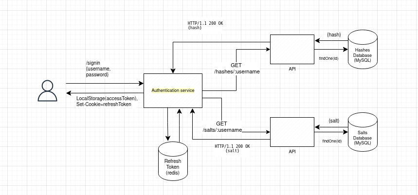

# Blog app

## Prerequisite

You will need to install Docker, docker-compose / Docker Compose plugin & node in order to run this project

## Starting the project

### Set env variales

Add env variables in root of the project so docker can set the database correctly

```bash
MYSQL_DATABASE=blog
MYSQL_USER=blog
MYSQL_PASSWORD=blog
MYSQL_HOST=localhost
MYSQL_ROOT_PASSWORD=blogroot

DATABASE_URL=mysql://blog:blog@db:3306/blog

REDIS_HOST=redis
REDIS_PASSWORD=redis
REDIS_PORT=6379
```

Since we're using elliptic curve algorithm (ES384) instead of default HS256 for signing and verifying tokens, you'll need to generate two private / public key pairs for access and refresh tokens in `/api/src/keys`.

private keys:

```bash
openssl ecparam -name secp384r1 -genkey -noout -out private-a.key
openssl ecparam -name secp384r1 -genkey -noout -out private-a.key
```

public keys:

```bash
openssl ec -in private-a.key -pubout -out public-a.pem
openssl ec -in private-r.key -pubout -out public-r.pem
```

### Docker

Start the project

```bash
docker compose up --build
```

Next, you'll need to sync schema with the database

```bash
docker compose exec api /bin/sh
```

then inside the api container

```bash
pnpm run db:push # sync the schema

pnpm run db:seed # seed the database
```

In this project four services communicate with each other: client, api, redis and the database. Also, there is prisma studio container.

client -> [localhost:3000](localhost:3000) api -> [localhost:5000](localhost:5000) prisma-studio -> [localhost:5555](localhost:5555) redis -> localhost:6379 db -> localhost:3306

### Connecting authentication services

Since this api is using two services for storing hashed passwords and corresponding salts, we need to add this container, hashes and salts api to the same network in development mode.

In production environment, both services will (preferably) be on separate host networks behind a firewall and accessed only through `colossal-potato`.

Clone <https://github.com/markonikolas/colossal-needle> into two separate folders

Follow readme for further instructions.

Here is the rough schema:


